# Unified AI Trading Platform Repository Intelligence and Target Architecture

Date: 2026-05-29

## Executive Summary

This document captures Phase 1 through Phase 9 analysis for unifying the requested exchange repositories into a single production-grade, AI-powered trading infrastructure platform. It intentionally does **not** perform Phase 10 code generation: the current mandate is repository intelligence, reverse engineering, comparison, target architecture, database design, AI design, security design, production-readiness design, and implementation planning before any rewrite or merge.

The analyzed upstream snapshots were cloned shallowly from GitHub on 2026-05-29:

| Repository | Snapshot | Role in ecosystem | Local file count |
|---|---:|---|---:|
| `openware/opendax` | `e204b565e687` | OpenDAX deployment/orchestration kit | 122 |
| `openware/baseapp` | `f719faf435ad` | OpenDAX React trading frontend | 1,961 |
| `openware/barong` | `1f488179596f` | OpenDAX identity/KYC/RBAC service | 435 |
| `openware/rango` | `1a3b15ecddab` | OpenDAX Go websocket fanout service | 29 |
| `PeatioCryptoExchange/peatio` | `b72788e452e8` | Ruby exchange core: markets, accounts, matching, settlement | 1,068 |
| `hollaex/hollaex-kit` | `1b8e5f3fe959` | Full-stack HollaEx exchange kit | 3,108 |
| `hollaex/hollaex-cli` | `53ed24edfdf0` | HollaEx deployment/ops CLI templates | 104 |
| `hollaex/hollaex-node-lib` | `ab8c2e35abdc` | HollaEx JS REST/websocket SDK | 15 |
| `Polygant/OpenCEX` | `12d721419cc4` | OpenCEX packaging/installer shell with Dockerfiles; public source is incomplete in this snapshot | 15 |

Strategic recommendation: use the repositories as **reference implementations and migration sources**, not as code to paste wholesale. The unified platform should preserve Peatio/OpenDAX's service-boundary lessons, Rango's websocket fanout pattern, HollaEx's product breadth and plugin/admin concepts, and OpenCEX's simplified exchange/wallet operational surface, while re-implementing the target system in the requested stack: Next.js + React + TypeScript frontend, NestJS + TypeScript backend, Python + FastAPI AI layer, PostgreSQL, Redis, Docker, Kubernetes, WebSockets, and event-driven services.

## Non-Negotiable Engineering Principles

1. **No blind copying.** Extract business invariants, schemas, flows, and operational patterns first.
2. **Ledger correctness before UX velocity.** Balances, reservations, settlement, and withdrawal controls must be modeled as auditable double-entry ledger transactions.
3. **Service boundaries before frameworks.** Identity, trading, wallets, market data, compliance, notifications, admin, risk, and AI must be independently deployable modules.
4. **Event-driven by default.** Every high-value state transition emits an immutable event for audit, projections, realtime, monitoring, and AI agents.
5. **Defense in depth.** Authentication, authorization, wallet signing, withdrawals, API keys, websocket subscriptions, secrets, and admin actions require separate controls and audit trails.
6. **Kubernetes-ready, not Kubernetes-only.** Local Docker Compose must exist for development; Helm/Kustomize manifests must exist for production.
7. **AI is advisory unless explicitly approved.** Agents can detect risk and recommend actions, but trade execution and withdrawal intervention must use policy-gated workflows.

---

# Phase 1: Repository Intelligence

## 1. `openware/opendax`

### Architecture Report

OpenDAX is primarily an orchestration and configuration repository for the Openware exchange stack. It does not own most business logic; instead it composes Barong, Peatio, Rango, frontend, gateway/proxy, Redis, RabbitMQ, MySQL, Vault, InfluxDB, monitoring exporters, and optional crypto nodes.

### Service Inventory

Observed Compose template services include:

- API/application services: `barong`, `peatio`, `applogic`, `finex-api`, `finex-engine`.
- Daemons/workers: `barong_sidekiq`, `applogic_sidekiq`, `matching`, `order_processor`, `trade_executor`, `deposit`, `deposit_coin_address`, `withdraw_coin`, `blockchain`, `listener`, `influx_writer`, `mailer`, `cron_job`, `rango`.
- Infrastructure: `db`, `redis`, `rabbitmq`, `vault`, `influxdb`, `proxy`, `gateway`.
- Frontend/admin: `frontend`, `tower`.
- Monitoring: `cadvisor`, `node_exporter`.
- Optional nodes/tools: `bitcoind`, `litecoind`, `parity`, `superset`, `arke-maker`.

### Technology Inventory

- Ruby/Rake deployment tooling.
- Docker Compose template generation through ERB.
- MySQL, Redis, RabbitMQ, Vault, InfluxDB.
- Prometheus-compatible exporters in monitoring compose templates.
- Reverse proxy/gateway configuration.

### Dependency Graph

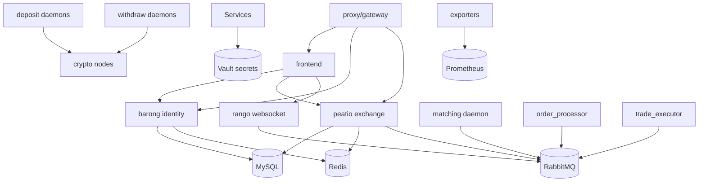

### Deployment Architecture

The repository is VM + Docker Compose oriented. It can be translated into Kubernetes, but Kubernetes-native concerns such as readiness probes, resource limits, pod disruption budgets, network policies, and secret-store CSI are not first-class in the inspected tree.

### Security Observations

- Positive: explicit Vault service, separation of identity and exchange services, JWT-based access implied by Barong/Rango integration.
- Risk: Compose-based deployments often lead to long-lived environment secrets, broad network trust, and weak service-to-service authorization unless hardened.
- Risk: optional blockchain nodes and hot wallet daemons increase blast radius when deployed on one VM.

## 2. `openware/baseapp`

### Architecture Report

Baseapp is the OpenDAX web/mobile trading frontend. It is a React 16 TypeScript application using Redux, redux-saga, React Router, PostCSS, TradingView charting assets, mock REST/websocket servers, Sentry, Capacitor/Ionic mobile wrappers, and Openware-specific UI modules.

### Service Inventory

- Browser SPA.
- NGINX static asset container.
- Mock REST and websocket servers for local development.
- Integration specs and Jest tests.

### Technology Inventory

- React `16.10`, TypeScript, Redux `4`, React Redux `7.1`, redux-saga `1.1`.
- `react-scripts` `3.4.3`, PostCSS 7, TSLint, Stylelint.
- TradingView charting library and custom datafeeds.
- Axios REST client, websocket client dependency `ws`.
- Sentry browser integration, Google reCAPTCHA, qrcode, web3 provider dependencies.
- Capacitor/Ionic for mobile packaging.

### Frontend Analysis

- **Frameworks:** React SPA; not server-rendered.
- **State management:** Redux + sagas; module folders indicate domain-specific trading/account state.
- **WebSocket usage:** mock websocket support and Rango/Ranger-like realtime subscriptions; expected channels for trades, orderbook incremental updates, user orders, balances.
- **Trading UI:** includes market screens, order forms, orderbook/depth, tickers, history, balances, verification, profile/security flows.
- **Charting:** embeds TradingView charting library assets and custom datafeed configuration.

### Dependency Graph

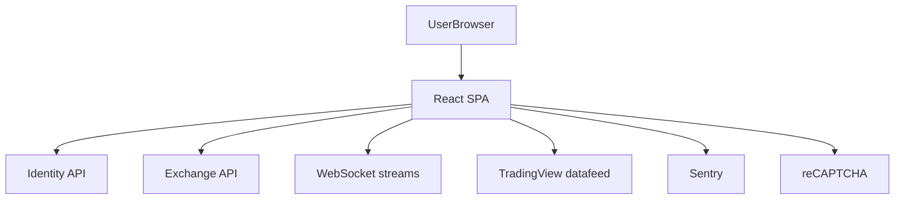

### Deployment Architecture

Static build served by NGINX/Docker. Mobile builds possible through Capacitor. Production readiness is constrained by old frontend dependencies and SPA-only SEO/performance limitations.

### Security Observations

- Risk: aged dependencies, TSLint-era toolchain, React 16, older Axios, older build chain.
- Positive: reCAPTCHA and Sentry support.
- Required in target: strict CSP, secure cookie/session approach, typed API clients, modern dependency scanning, websocket token rotation.

## 3. `openware/barong`

### Architecture Report

Barong is a Rails 5 identity, KYC, security, and authorization service. It owns users, profiles, documents, labels/roles, permissions, activities, API keys, phones, service accounts, comments, restrictions, and KYC integrations.

### Service Inventory

- Rails API service using Grape.
- Sidekiq workers.
- Mailers and event mailer service.
- KYC service integration.
- Captcha, TOTP, Twilio verification/SMS, password strength, encryption and secret storage services.

### Technology Inventory

- Ruby `~> 2.6.5`, Rails `~> 5.2.4`, MySQL, Redis, Sidekiq, Grape, JWT, Bunny/RabbitMQ.
- CarrierWave and fog adapters for AWS/GCP/AliCloud document storage.
- Kycaid KYC integration, Twilio support, TOTP.

### Backend Analysis

- **APIs:** Grape v2 API modules with validation/exception helpers.
- **Services:** KYC, captcha, encryption, secret storage, TOTP, Twilio, UID generation.
- **Workers:** Sidekiq for asynchronous mail/events/verification workflows.
- **Business boundary:** canonical identity and compliance metadata source in OpenDAX.

### Database Analysis

Key models: `User`, `Profile`, `Document`, `Label`, `Permission`, `ApiKey`, `Activity`, `Phone`, `Level`, `Restriction`, `ServiceAccount`, `Comment`, `DataStorage`. There are 25 migrations in the inspected snapshot.

### Dependency Graph

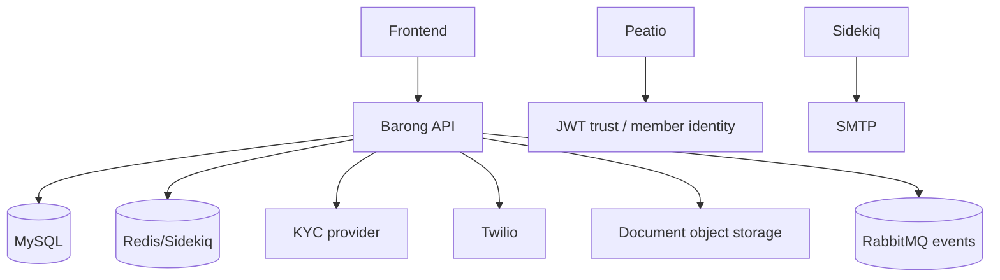

### Deployment Architecture

Containerized Rails app with separate Sidekiq workers. It can scale horizontally for stateless APIs; Sidekiq queues require worker partitioning and idempotency.

### Security Observations

- Positive: purpose-built identity service, API keys, labels/permissions, activity audit, encrypted fields added in later migrations.
- Risk: Rails 5/Ruby 2.6 is legacy; must upgrade or reimplement.
- Risk: document/KYC PII storage requires strict encryption, retention, access control, and immutable admin audit trails.

## 4. `openware/rango`

### Architecture Report

Rango is a Go websocket fanout service intended as a faster replacement for Ruby Ranger. It subscribes to RabbitMQ and dispatches public, private, and prefixed/RBAC websocket streams to clients.

### Service Inventory

- Websocket server.
- AMQP consumer.
- JWT authentication/authorization component.
- Routing hub/topic/client abstractions.
- Prometheus metrics endpoint on port `4242`.
- CLI tools: inject message, JWT utility, websocket client.

### Technology Inventory

- Go modules.
- RabbitMQ/AMQP.
- JWT authentication.
- Prometheus metrics.

### Realtime Analysis

- **Public streams:** e.g. `public.market.event` for orderbook, klines, tickers, trades.
- **Private streams:** e.g. `private.UID.event` for user-specific orders/trades/balances.
- **Prefixed streams:** role-protected streams such as admin/system/accounting.
- **Client protocol:** subscribe/unsubscribe JSON events with stream arrays.

### Dependency Graph

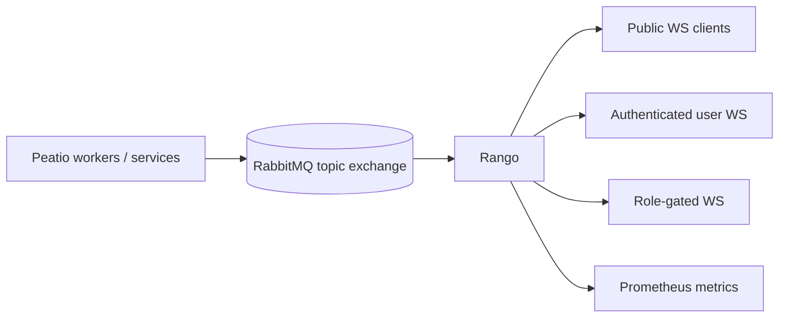

### Deployment Architecture

Stateless websocket service can scale horizontally if each instance consumes broadcast events and manages local subscribers. Sticky sessions are not required if subscriptions are per connection and all instances receive all relevant events.

### Security Observations

- Positive: stream scope separation and RBAC-prefixed streams.
- Risk: JWT validation and authorization policy must be centralized and kept current.
- Target: add connection rate limits, per-topic authorization cache with short TTL, token refresh protocol, and websocket audit for admin/private subscriptions.

## 5. `PeatioCryptoExchange/peatio`

### Architecture Report

Peatio is the legacy Ruby/Rails exchange core. It contains APIs for deposits, markets, members, order books, orders, tickers, tools, trades, websocket protocol; models for accounts, account versions, currencies, markets, orders, trades, deposits, withdrawals, payment addresses, payment transactions; and matching/execution classes.

### Service Inventory

- Rails API service using Grape.
- Matching engine classes: `Matching::Engine`, `OrderBook`, `OrderBookManager`, `LimitOrder`, `MarketOrder`, `Executor`, `PriceLevel`.
- Daemons: matching, order processor, trade executor, deposit coin, withdraw coin, hot wallets, market data, notification, stats, websocket API, withdraw audit, payment transaction.
- Worker model classes: deposit/withdraw coin, order processor, trade executor, matching, pusher market/member, stats, wallet stats, notifications.

### Technology Inventory

- Rails `~> 4.0.12`, Ruby legacy stack, MySQL, RabbitMQ via Bunny, Grape API.
- Blockchain coin RPC integrations.
- ActiveRecord models, AASM-like state machines.

### Backend Analysis

- **APIs:** trading REST, market data, deposit/withdraw/account endpoints.
- **Matching:** in-process matching components connected to daemons and queues.
- **Queues/workers:** AMQP-based command/event movement between order intake, matching, and settlement workers.
- **Wallets:** deposit/withdraw models and coin RPC daemons.

### Database Analysis

Key models include `Account`, `AccountVersion`, `Currency`, `Market`, `Order`, `OrderBid`, `OrderAsk`, `Trade`, `Deposit`, `Withdraw`, `PaymentAddress`, `PaymentTransaction`, `Member`, `ApiToken`, and audit logs. There are 142 migrations in the inspected snapshot. Account versioning is especially important as a historical ledger-like pattern, but target design should enforce double-entry ledger invariants explicitly.

### Dependency Graph

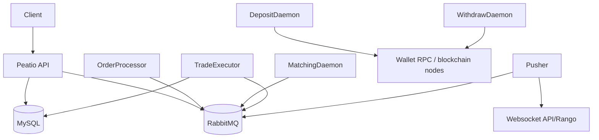

### Deployment Architecture

Peatio requires multiple specialized daemon processes. Horizontal scaling requires single-writer constraints per market/orderbook and strict idempotency for settlement. Wallet daemons must be isolated from public API workloads.

### Security Observations

- Positive: mature exchange domain decomposition; separate daemons for matching, settlement, deposits, withdrawals.
- Risk: Rails 4 and old dependencies are unsuitable for new production without major remediation.
- Risk: wallet RPC and withdrawal daemons demand strong network segmentation and HSM/MPC integration in the target architecture.

## 6. `hollaex/hollaex-kit`

### Architecture Report

HollaEx Kit is a larger full-stack exchange product. It includes an Express/Node backend with Sequelize/Postgres migrations, websocket server, Swagger API definitions, plugin support, admin features, P2P, stake, broker, shared/subaccount, fiat, notification, order/trade/deposit/withdraw controllers, and a React web frontend.

### Service Inventory

- Server API controllers: `admin`, `broker`, `deposit`, `fiat`, `notification`, `order`, `otp`, `p2p`, `public`, `sharedaccount`, `stake`, `subaccount`, `tier`, `trade`, `user`, `withdrawal`.
- Server websocket modules: `hub`, `server`, `channel`, `sub`, `publicData`, `priceStore`, chat modules.
- Database models: user, role, session, token, login, otp, verification images, audit, tier, plugin, status, subaccount, shared account, broker, P2P, stake, balance history, transaction limit, passkey.
- Web UI: React 16 app with Ant Design and admin/trading feature modules.
- NGINX/static layer, plugins, test automation, local and Kubernetes templates.

### Technology Inventory

- Backend: Express `4.21`, Sequelize `6.24`, PostgreSQL `8.x` client, Redis `2.8`, ws `8.12`, Swagger tools, JWT `9`, bcryptjs, CCXT `4.5`, Elastic APM, Winston, Node cron.
- Frontend: React `16.13`, Redux, redux-thunk/promise, Ant Design `4.6`, Highcharts, hollaex-web-lib, web3, APM RUM.
- Database: PostgreSQL migrations count: 136 in server snapshot.
- Infrastructure: Docker, NGINX, local templates, Kubernetes templates.

### Frontend Analysis

- **Frameworks:** React SPA, Ant Design-heavy admin/product UI.
- **State management:** Redux + thunk/promise middleware.
- **WebSocket usage:** HollaEx websocket modules and heartbeat libraries.
- **Trading UI:** exchange, quick trade, P2P, staking, broker/admin surfaces.
- **Charting:** Highcharts and exchange-specific data flows.

### Backend Analysis

- **APIs:** broad product API coverage via controller and Swagger modules.
- **Services/workers:** cron tasks, plugins, mail, Redis, external liquidity/market tooling through CCXT and internal network libs.
- **Queues:** less obviously AMQP-centric than OpenDAX; Redis and websocket modules are prominent.
- **Business breadth:** stronger product/admin breadth than Peatio/OpenDAX.

### Dependency Graph

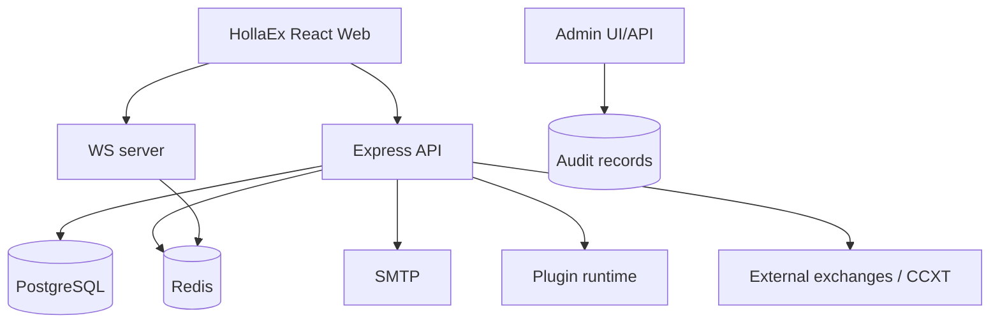

### Deployment Architecture

HollaEx has stronger product packaging, NGINX, local, and Kubernetes template presence than OpenDAX's older Compose-only posture, but still uses a legacy React/Node architecture and many older dependencies.

### Security Observations

- Positive: audit model, roles, sessions, passkeys, OTP, transaction limits, admin audit calls in controllers.
- Positive: Swagger definitions help API governance.
- Risk: plugin runtime expands supply-chain and sandboxing risks.
- Risk: aged frontend and backend dependencies remain; `request` and old Redis client should be eliminated in target.

## 7. `hollaex/hollaex-cli`

### Architecture Report

The CLI repository is an operational/deployment companion for HollaEx. It includes Docker, nginx-certbot, Kubernetes Helm chart, local templates, and plugin tooling.

### Service Inventory

- CLI scripts/templates for local and Kubernetes deployment.
- Helm chart templates.
- NGINX/certbot assets.
- Plugin tooling docs.

### Technology Inventory

- Shell/Node operational tooling.
- Docker and Kubernetes YAML/Helm templates.
- NGINX and certbot.

### Dependency Graph

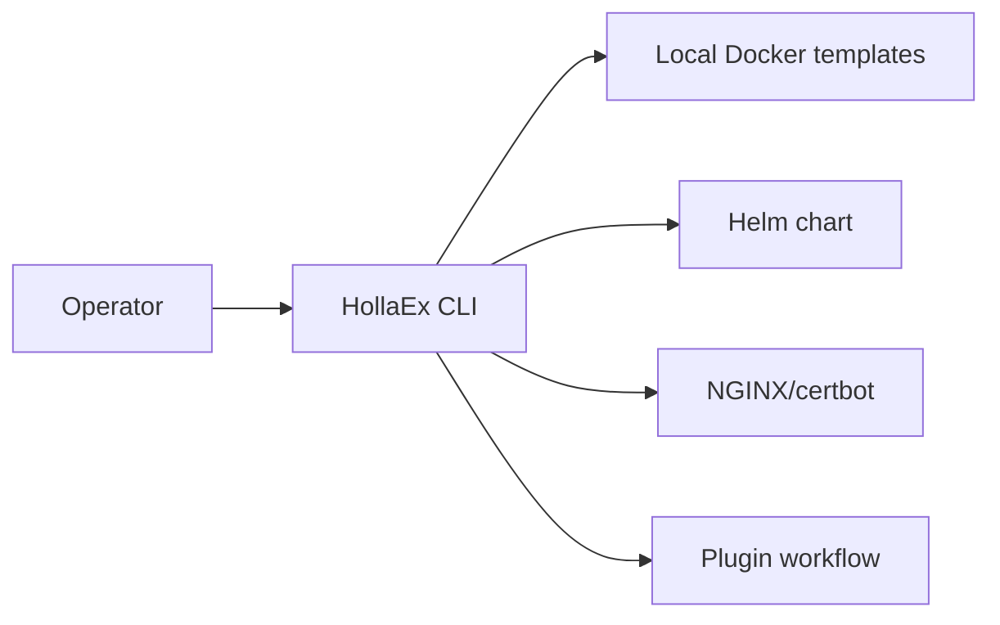

### Deployment Architecture

Useful as an operational reference for user-friendly deployment flows and Helm packaging, not as core runtime business logic.

### Security Observations

- Risk: deployment CLIs can leak secrets into local files and shell history if not carefully designed.
- Target: use secret managers, sealed secrets/external-secrets, validation, drift detection, and generated manifests with least privilege.

## 8. `hollaex/hollaex-node-lib`

### Architecture Report

A small JavaScript SDK for HollaEx REST and websocket APIs. It exposes client-facing API and websocket abstractions for integrations/bots.

### Service Inventory

- Node library entrypoint.
- REST tests and websocket tests.
- Example app.

### Technology Inventory

- Node.js, `ws`, `ws-heartbeat`, lodash, moment, `request`/`request-promise`.
- Mocha/Chai tests.

### Dependency Graph

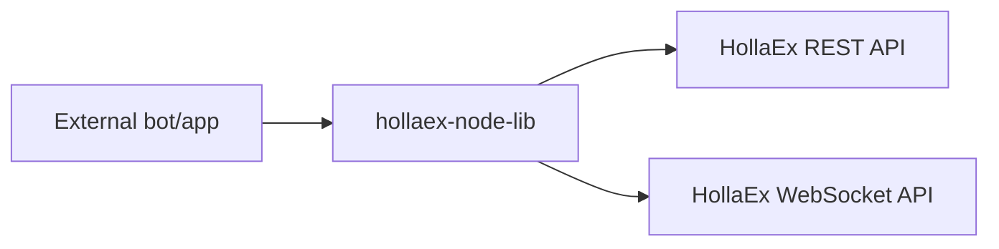

### Deployment Architecture

Library, not service. Target system should produce a modern typed SDK generated from OpenAPI and AsyncAPI specs.

### Security Observations

- Risk: legacy `request` dependency and untyped JS.
- Target: TypeScript SDK with signed request helpers, token redaction, and secure websocket reconnection patterns.

## 9. `Polygant/OpenCEX`

### Architecture Report

The inspected snapshot contains README, installer shell, Dockerfiles, NGINX config, environment templates, and a caution that the repository is not maintained. It describes a Django/Postgres/Redis/RabbitMQ/Vue/Nuxt/Caddy/NGINX/Bitcoin Core exchange with wallet, matching, KYC, KYT, SMS 2FA, and quick swap features, but the public snapshot does not include full backend/frontend source beyond packaging files.

### Service Inventory

Based on README and Dockerfiles:

- Backend container based on Python 3.8/Django.
- Frontend/admin static containers.
- Nuxt container.
- Postgres, Redis, RabbitMQ, Caddy, NGINX, Bitcoin Core runtime dependencies.
- Optional providers: Scorechain KYT, Sumsub KYC, Twilio SMS, Infura/Etherscan/Bscscan/TronGrid.

### Technology Inventory

- Docker, NGINX, Caddy.
- PostgreSQL 14.5, Redis 7, RabbitMQ 3.10.
- Python 3.8, Django 3.2.7.
- Vue 3.2, Nuxt 2.15.

### Dependency Graph

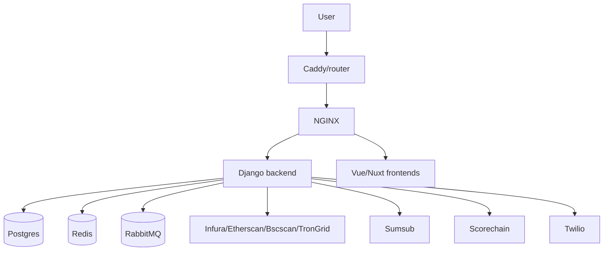

### Deployment Architecture

Single-server Docker-oriented deployment. Because source is absent/incomplete in the inspected snapshot and README says it is not maintained, use only as product-feature reference.

### Security Observations

- Positive: explicitly includes KYT, KYC, SMS 2FA, recaptcha, cold collection addresses.
- Risk: unmaintained, incomplete source, Python 3.8 baseline, unclear wallet custody controls.

---

# Phase 2: System Reverse Engineering

The following flows merge observed patterns from OpenDAX/Peatio/Barong/Rango and HollaEx, then state target behavior for the unified platform.

## User Registration Flow

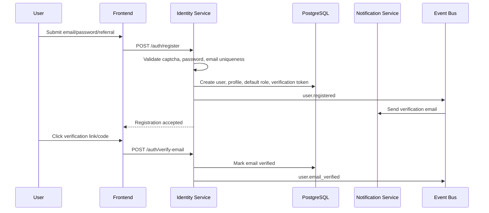

## Login Flow

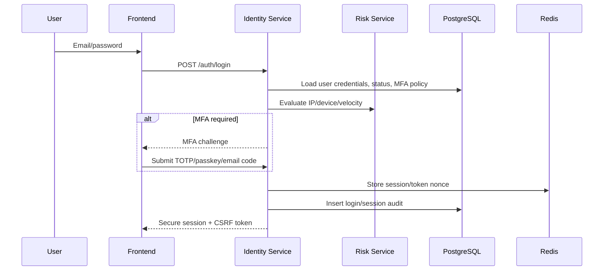

## KYC Flow

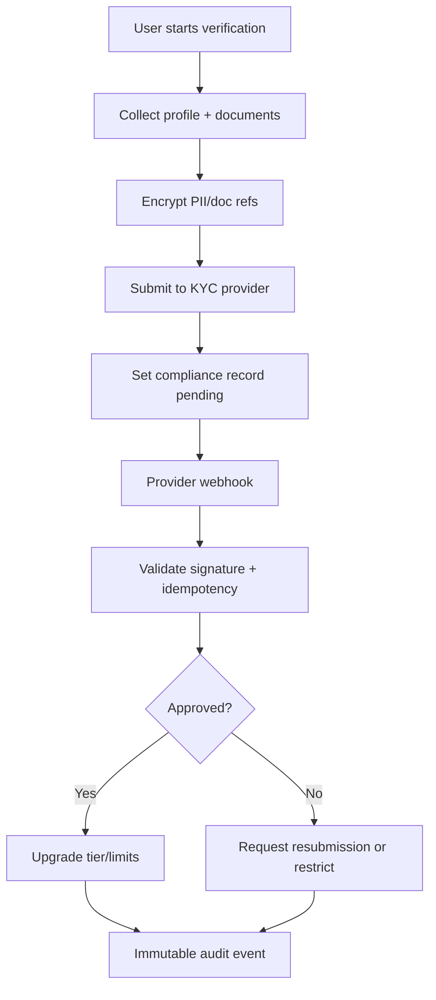

## Wallet Creation

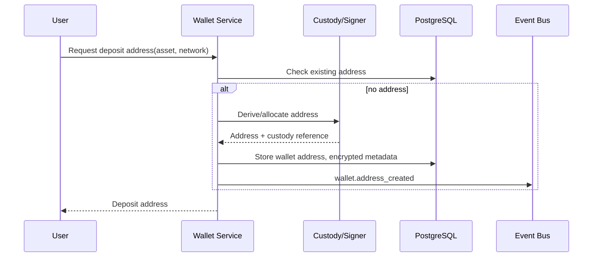

## Deposit Flow

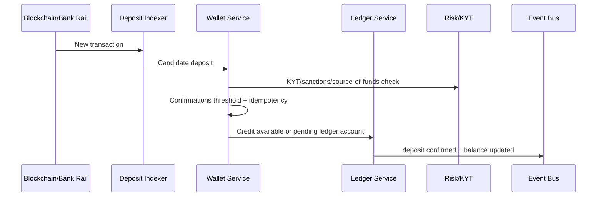

## Withdrawal Flow

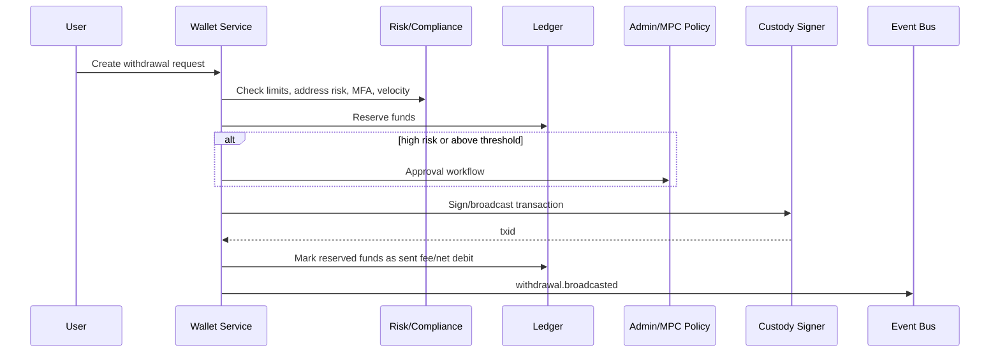

## Balance Management

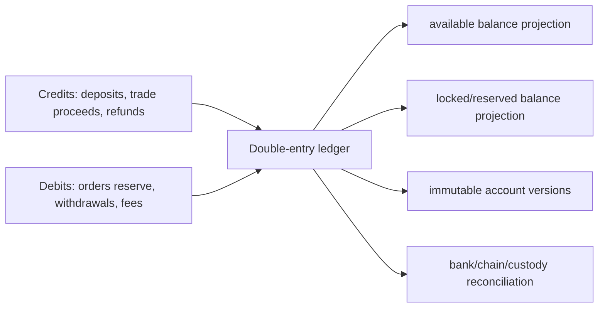

## Order Placement, Matching, Execution, and Settlement

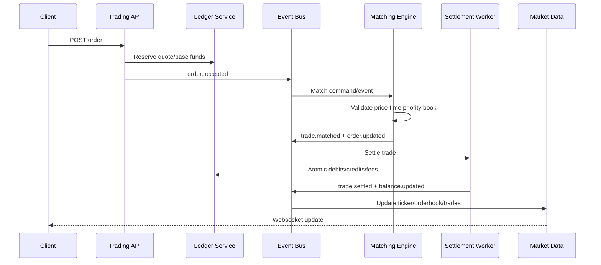

## Market Data Streaming

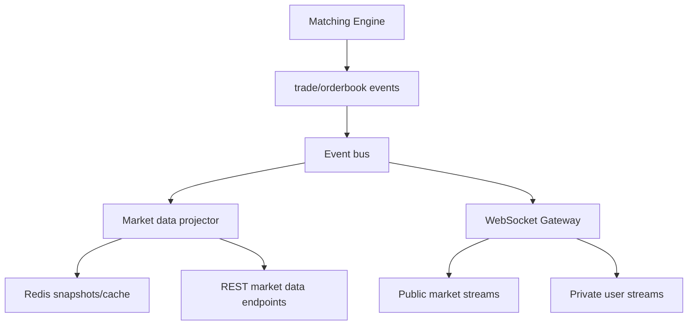

## Notification Delivery

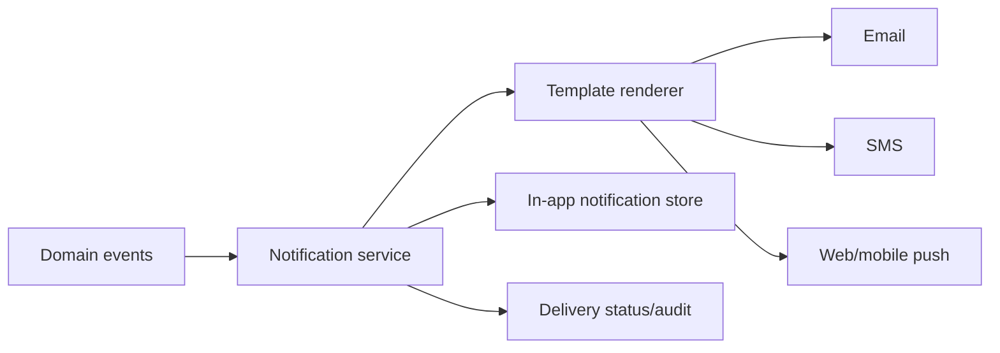

## Admin Operations

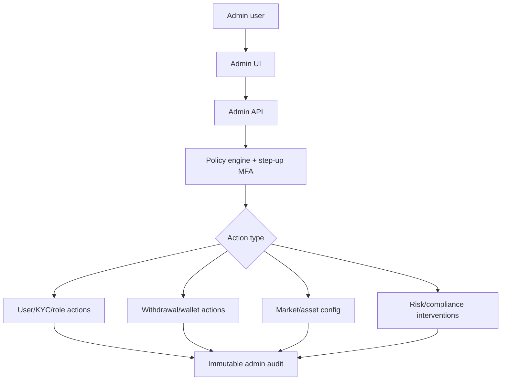

---

# Phase 3: Comparison Matrix and Subsystem Decisions

## Repository Comparison Matrix

| Repository | Strengths | Weaknesses | Security Quality | Scalability | Maintainability | Frontend Quality | Backend Quality | Production Readiness | AI Integration Readiness |
|---|---|---|---|---|---|---|---|---|---|
| OpenDAX | Clear multi-service deployment composition; battle-tested service split | Compose/VM centric; legacy stack; business logic elsewhere | Medium: Vault and separation help; hardening required | Medium: services split but compose defaults constrain | Medium-low | N/A | N/A orchestration | Medium for legacy deployments | Low; events exist but no AI contracts |
| Baseapp | Complete trading UX; TradingView; mocks; mobile wrappers | React 16/CRA/TSLint legacy; SPA-only; dependency age | Medium-low due dependency age | Medium for static frontend | Medium-low | Medium: good coverage, old stack | N/A | Medium | Medium-low; UI can consume recommendations after redesign |
| Barong | Strong identity/KYC/RBAC boundary; audit/activity concepts | Rails 5/Ruby 2.6 legacy; MySQL coupling | Medium-high conceptually; implementation aging | Medium: stateless API + Sidekiq | Medium | N/A | Medium-high domain quality | Medium | Medium: compliance events can feed agents |
| Rango | Small, focused, fast Go websocket fanout; Prometheus metrics | Narrow feature set; RabbitMQ-specific | Medium: JWT/RBAC streams; needs modern controls | High horizontal potential | High due small surface | N/A | High for websocket boundary | High as reference | Medium-high for event streaming |
| Peatio | Rich exchange core; matching, settlement, wallet daemon concepts | Rails 4; old dependencies; complex daemon coupling | Medium conceptually; high remediation need | Medium with careful market partitioning | Low-medium | N/A | High domain coverage, legacy implementation | Medium-low without modernization | Medium: domain events are valuable |
| HollaEx Kit | Broad product/admin/P2P/staking/plugin features; Postgres; Swagger; Kubernetes templates | Large monolith tendencies; many old deps; plugin risk | Medium; audit/OTP/passkeys present | Medium | Medium | Medium: comprehensive but legacy React | Medium: broad but Node/Express legacy | Medium-high product coverage | Medium-high: plugins/events useful |
| HollaEx CLI | Deployment UX and Helm/local templates | Operational only; not runtime logic | Medium if secrets handled; uncertain | N/A | Medium | N/A | N/A | Medium as ops reference | Low |
| HollaEx Node Lib | Simple SDK reference | Tiny untyped legacy JS, deprecated request | Low-medium | N/A | Low-medium | N/A | N/A | Medium as integration pattern | Medium as SDK target reference |
| OpenCEX | Simple product positioning; Django/Postgres/RabbitMQ stack; KYT/KYC reference | Unmaintained and source incomplete in inspected snapshot | Unknown/low confidence | Unknown | Low | Unknown | Unknown | Low | Low |

## Major Subsystem Recommendations

| Subsystem | Recommendation | Source inspiration | Rationale |
|---|---|---|---|
| Web trading UI | REPLACE | Baseapp + HollaEx UX references | Build Next.js/React/TS/Tailwind; preserve UX patterns, not legacy CRA code. |
| Admin UI | REFACTOR/REPLACE | HollaEx admin breadth, OpenDAX Tower concept | Build unified Next.js admin with strict RBAC, audit, step-up MFA. |
| Identity/auth | REFACTOR | Barong concepts, HollaEx passkeys/sessions | Reimplement in NestJS with modern OAuth2/OIDC-compatible sessions, passkeys, MFA. |
| KYC/compliance | REFACTOR | Barong KYC, OpenCEX Sumsub/KYT, HollaEx tiers | Create provider-agnostic compliance service with encrypted PII. |
| Matching engine | REFACTOR | Peatio matching model | Keep price-time priority concepts; implement market-sharded deterministic engine with event log. |
| Ledger/balances | REPLACE | Peatio account versions | Use explicit double-entry ledger, immutable journal, projections. |
| Wallet/custody | REPLACE | Peatio/OpenCEX wallet flows | Integrate HSM/MPC/custody providers; isolate hot wallet signing. |
| Websocket streaming | KEEP/REFACTOR | Rango | Keep scope model; implement TS/Go-compatible websocket gateway with AsyncAPI and Redis/event bus adapters. |
| Market data | REFACTOR | Peatio/HollaEx | Dedicated projector service with snapshots, incremental deltas, replay. |
| Notifications | REFACTOR | Barong/HollaEx | Central notification service with templates, delivery logs, user preferences. |
| Deployment tooling | REFACTOR | OpenDAX + HollaEx CLI | Modern Docker Compose for dev plus Helm/Kustomize for prod. |
| SDK/API clients | REPLACE | HollaEx node lib | Generate typed SDKs from OpenAPI/AsyncAPI. |
| Plugin system | REFACTOR cautiously | HollaEx plugins | Use signed, sandboxed plugins only for UI/admin extensions and webhooks; not core custody/trading. |
| AI layer | NEW | None direct | Build FastAPI agent runtime with tool calling, memory, and event-driven workflows. |

---

# Phase 4: Target Architecture

## Target Service Topology

```mermaid
graph TD
  subgraph Edge
    CDN[CDN/WAF]
    Web[Next.js Web]
    Admin[Next.js Admin]
    APIGW[API Gateway]
    WSGW[WebSocket Gateway]
  end

  subgraph Core NestJS Services
    IAM[Identity Service]
    Trading[Trading API]
    Match[Matching Engine Service]
    Ledger[Ledger Service]
    Wallet[Wallet Service]
    MarketData[Market Data Service]
    Compliance[Compliance Service]
    Risk[Risk Service]
    Notify[Notification Service]
    AdminSvc[Admin Service]
  end

  subgraph AI FastAPI Layer
    AgentAPI[Agent Gateway]
    MarketAgent[Market Analysis Agent]
    RiskAgent[Risk Analysis Agent]
    TradeAgent[Trading Assistant Agent]
    PortfolioAgent[Portfolio Agent]
    FraudAgent[Fraud Detection Agent]
    SupportAgent[Support Agent]
    ComplianceAgent[Compliance Agent]
  end

  subgraph Data
    PG[(PostgreSQL)]
    Redis[(Redis)]
    Bus[(Event Bus: NATS/Kafka/RabbitMQ abstraction)]
    Obj[(Object Storage)]
    Vector[(Vector Store / pgvector)]
  end

  CDN --> Web
  CDN --> Admin
  Web --> APIGW
  Admin --> APIGW
  Web --> WSGW
  Admin --> WSGW
  APIGW --> IAM
  APIGW --> Trading
  APIGW --> Wallet
  APIGW --> AdminSvc
  Trading --> Ledger
  Trading --> Bus
  Match --> Bus
  Match --> Ledger
  Wallet --> Ledger
  Wallet --> Compliance
  MarketData --> Redis
  MarketData --> Bus
  WSGW --> Bus
  IAM --> PG
  Ledger --> PG
  Wallet --> PG
  Compliance --> PG
  Notify --> Bus
  AgentAPI --> Bus
  AgentAPI --> Vector
  AgentAPI --> PG
  RiskAgent --> Risk
  FraudAgent --> Wallet
```

## Target Technology Stack

- **Frontend:** Next.js, React, TypeScript, Tailwind, TanStack Query, Zustand or Redux Toolkit only where global state is justified, TradingView-compatible chart adapter, typed OpenAPI/AsyncAPI clients.
- **Backend:** NestJS, TypeScript, modular monorepo packages, PostgreSQL via Prisma/Drizzle/TypeORM with migration discipline, Redis for cache/locks/rate limits, event-bus abstraction.
- **AI Layer:** Python FastAPI, OpenAI-compatible model interface, local model support, tool registry, workflow engine, pgvector memory, event subscriptions, trace instrumentation.
- **Databases:** PostgreSQL primary OLTP with partitioned high-volume tables; Redis for ephemeral projections, locks, websocket presence, rate limiting.
- **Infrastructure:** Docker, Compose for local, Kubernetes/Helm for production, OpenTelemetry, Prometheus, Grafana, Loki/ELK, Vault/External Secrets, cert-manager, network policies.
- **Realtime:** WebSockets with public/private/admin namespaces, event-driven market data and private updates.

## Service Boundary Rules

- Identity owns users, auth factors, sessions, API keys, roles, and permissions.
- Compliance owns KYC/KYT/compliance records, restrictions, policy decisions, and PII documents.
- Ledger owns all balance-changing writes and immutable journals.
- Trading API validates orders and reserves funds, but matching engine owns book state.
- Matching engine emits deterministic matches; settlement worker commits ledger effects.
- Wallet service owns addresses, deposit indexing, withdrawal workflows, custody integration.
- Market data service owns tickers, candles, orderbook projections, historical queries.
- AI services are consumers/producers of recommendations/risk events; they do not bypass policy gates.

---

# Phase 5: Database Architecture

## Core ERD

```mermaid
erDiagram
  users ||--o{ sessions : has
  users ||--o{ user_roles : has
  roles ||--o{ user_roles : grants
  roles ||--o{ role_permissions : includes
  permissions ||--o{ role_permissions : maps
  users ||--o{ wallets : owns
  assets ||--o{ wallets : denominates
  assets ||--o{ balances : denominates
  users ||--o{ balances : owns
  markets ||--o{ orders : lists
  users ||--o{ orders : places
  orders ||--o{ trades : maker_or_taker
  users ||--o{ deposits : receives
  users ||--o{ withdrawals : requests
  wallets ||--o{ deposits : receives
  wallets ||--o{ withdrawals : sends
  users ||--o{ audit_logs : actor
  users ||--o{ notifications : receives
  users ||--o{ compliance_records : subject
  users ||--o{ ai_recommendations : receives
  users ||--o{ risk_events : subject
  users ||--o{ fraud_events : subject
  balances ||--o{ ledger_entries : projects
  ledger_transactions ||--o{ ledger_entries : contains
```

## Production Schema Groups

### Identity and Access

- `users`: `id uuid pk`, `uid text unique`, `email citext unique`, `username citext unique null`, `password_hash`, `status`, `email_verified_at`, `phone_verified_at`, `created_at`, `updated_at`, `deleted_at`.
- `sessions`: `id uuid pk`, `user_id`, `token_hash`, `refresh_token_hash`, `ip`, `user_agent`, `device_id`, `mfa_level`, `expires_at`, `revoked_at`.
- `roles`: `id`, `code unique`, `name`, `scope`, `system`.
- `permissions`: `id`, `resource`, `action`, `condition jsonb`.
- `user_roles`, `role_permissions` join tables.
- `auth_factors`: TOTP, passkey, SMS/email challenge metadata.
- `api_keys`: `id`, `user_id`, `kid`, `public_key/hash`, `scopes`, `ip_whitelist`, `last_used_at`, `revoked_at`.

### Assets, Markets, Wallets, Balances

- `assets`: `id`, `symbol unique`, `name`, `type`, `precision`, `min_confirmations`, `withdraw_fee`, `deposit_enabled`, `withdraw_enabled`, `metadata jsonb`.
- `networks`: chain/rail definitions.
- `asset_networks`: supported asset/network combinations.
- `markets`: `id`, `symbol unique`, `base_asset_id`, `quote_asset_id`, `price_precision`, `amount_precision`, `min_order_size`, `status`.
- `wallets`: user asset-network deposit accounts; `custody_ref`, `address`, `tag/memo`, `status`.
- `balances`: projection table with `available`, `locked`, `total`, `version`; unique `(user_id, asset_id)`.
- `ledger_accounts`: system/user accounts for available, locked, fees, custody, clearing.
- `ledger_transactions`: immutable transaction header with idempotency key, type, status, causation/correlation ids.
- `ledger_entries`: debit/credit lines; enforced sum-zero per transaction and positive amount constraint.

### Trading

- `orders`: `id`, `client_order_id`, `user_id`, `market_id`, `side`, `type`, `time_in_force`, `price`, `quantity`, `filled_quantity`, `remaining_quantity`, `status`, `created_at`, `updated_at`.
- `order_events`: append-only state transitions.
- `trades`: `id`, `market_id`, `maker_order_id`, `taker_order_id`, `price`, `quantity`, `maker_user_id`, `taker_user_id`, `maker_fee`, `taker_fee`, `settled_at`.
- `order_book_snapshots`: periodic snapshots for recovery.
- `candles`: partitioned by market/interval/time.

### Funds Movement

- `deposits`: `id`, `user_id`, `asset_id`, `network_id`, `wallet_id`, `tx_hash`, `chain_event_key`, `amount`, `confirmations`, `status`, `risk_status`, `credited_at`.
  - `chain_event_key` is required and normalizes the chain-specific credit source into a non-null string: UTXO chains use `vout:<output_index>`, EVM/token transfers use `log:<log_index>`, and account/native transfers use `trace:<trace_address>` or `native:0:<to_address>` when no trace index exists.
- `withdrawals`: `id`, `user_id`, `asset_id`, `network_id`, `address`, `tag`, `amount`, `fee`, `status`, `risk_status`, `approval_status`, `tx_hash`, `broadcast_at`.
- `withdrawal_approvals`: multi-step approvals with actor, policy, decision, reason.
- `custody_transactions`: signer/MPC/HSM references and reconciliation state.

### Compliance, Risk, Fraud, AI, Notifications, Audit

- `compliance_records`: KYC/KYT provider, external id, level, status, encrypted PII refs, decision metadata.
- `risk_events`: risk type, severity, score, subject, object, policy, action, status.
- `fraud_events`: model/rule id, features hash, decision, analyst feedback.
- `ai_recommendations`: agent, subject user/market, recommendation type, confidence, rationale ref, status, human decision.
- `agent_memories`: user/market-scoped durable memory with vector embedding reference.
- `notifications`: channel, template, payload, delivery status, read status.
- `audit_logs`: immutable actor/action/resource records with before/after hashes, IP, user agent, trace id.

## Indexing Strategy

- Use UUID primary keys plus monotonic `created_at` indexes for operational tables.
- `users(email)`, `users(uid)`, `api_keys(kid)`, `sessions(token_hash)` unique indexes.
- `orders(market_id, status, side, price, created_at)` optimized per matching queries; partial indexes for open orders.
- `trades(market_id, created_at desc)` and time partitioning for history.
- `ledger_entries(account_id, created_at)`, `ledger_transactions(idempotency_key unique)`.
- `deposits(network_id, tx_hash, chain_event_key)` unique idempotency index; `chain_event_key` must be `NOT NULL` so account-based deposits remain idempotent during indexer retries and reorg replay.
- If a legacy schema keeps nullable `output_index`, add expression/partial unique indexes instead of relying on nullable uniqueness, for example `unique(network_id, tx_hash, coalesce(output_index::text, chain_event_key))` with `chain_event_key NOT NULL` for account-based chains.
- `withdrawals(user_id, status, created_at)` and `withdrawals(status, risk_status)` operational indexes.
- GIN indexes on JSONB policy metadata only where query patterns prove value.
- Partition `audit_logs`, `trades`, `order_events`, `ledger_entries`, `notifications`, and `candles` by time.

## Migration Plan

1. Inventory legacy schema fields from Barong, Peatio, and HollaEx.
2. Build canonical schema in PostgreSQL with mapping tables for legacy IDs.
3. Migrate identity users first with password hash compatibility or forced reset policy.
4. Migrate KYC/compliance records with encrypted document references.
5. Migrate assets/markets and freeze trading during final ledger cutover.
6. Reconstruct balances from ledger/account versions, compare against legacy balances, produce signed reconciliation report.
7. Migrate open orders only during controlled maintenance window; otherwise cancel/refund before cutover.
8. Migrate deposits/withdrawals history and tx references.
9. Backfill audit logs and immutable event history.
10. Run dual-read shadow mode, then dual-write only where safe, then final switchover.

---

# Phase 6: AI System Design

## AI Agent Architecture

```mermaid
graph TD
  Events[Domain Events] --> AgentGateway[FastAPI Agent Gateway]
  AgentGateway --> Router[Agent Router / Policy]
  Router --> MarketAgent[Market Analysis Agent]
  Router --> RiskAgent[Risk Analysis Agent]
  Router --> TradingAgent[Trading Assistant Agent]
  Router --> PortfolioAgent[Portfolio Agent]
  Router --> FraudAgent[Fraud Detection Agent]
  Router --> SupportAgent[Customer Support Agent]
  Router --> ComplianceAgent[Compliance Agent]
  Agents[(Agents)] --> Tools[Tool Registry]
  Tools --> MarketTools[Market data tools]
  Tools --> UserTools[User/account tools]
  Tools --> RiskTools[Risk/compliance tools]
  Tools --> TicketTools[Support/ticket tools]
  Agents --> Memory[(pgvector/Redis memory)]
  Agents --> Models[OpenAI-compatible or local models]
  Agents --> Observability[Traces/metrics/evals]
  Agents --> Recommendations[AI Recommendations / Risk Events]
```

## Agents

- **Market Analysis Agent:** consumes trades, candles, orderbook imbalance, news/vendor feeds; produces market summaries, anomaly flags, volatility regimes.
- **Risk Analysis Agent:** monitors user, order, withdrawal, and exposure events; suggests limits, liquidations, or manual review.
- **Trading Assistant Agent:** answers user portfolio/market questions, explains orders and risk; never places trades without explicit user confirmation and policy checks.
- **Portfolio Agent:** evaluates holdings, PnL, allocation drift, concentration, and tax/export hints.
- **Fraud Detection Agent:** combines deterministic rules, graph analysis, device/IP fingerprints, behavioral patterns, and model scoring.
- **Customer Support Agent:** retrieves user-visible account facts, support docs, and ticket history; escalates sensitive actions.
- **Compliance Agent:** monitors KYC/KYT, sanctions, suspicious activity patterns, Travel Rule workflows, and regulator/audit evidence packs.

## Memory, Tool Calling, and Local/OpenAI-Compatible Support

- **Short-term memory:** Redis conversation/session state with TTL.
- **Long-term memory:** `agent_memories` and pgvector embeddings scoped by user, market, tenant, or incident.
- **Tool calling:** strict schema tools with allowlists, policy engine, audit logging, and dry-run mode.
- **Model abstraction:** OpenAI-compatible chat/completions and embeddings interface; local model adapters for Ollama/vLLM/TGI.
- **Safety:** PII minimization, prompt-injection defenses for retrieved documents, response policy filters, human approval for irreversible actions.
- **Observability:** OpenTelemetry spans per agent step, tool latency, model cost, hallucination/eval scores, recommendation outcome tracking.

---

# Phase 7: Security Architecture

## Vulnerability Report and Fixes

| Area | Observed/likely risk | Proposed fix |
|---|---|---|
| Authentication | Legacy Rails/React/Node dependencies; mixed JWT/session patterns | Central IAM, secure HTTP-only cookies for web, signed API keys for bots, passkeys/TOTP, token rotation and revocation. |
| Authorization | Role labels can drift across services | Central policy engine, typed permission catalog, service-side authorization on every endpoint and websocket subscription. |
| Secrets | Compose/env secret sprawl | Vault or cloud KMS + External Secrets; no plaintext secrets in generated configs. |
| Wallet security | Hot wallet daemons can share network with app services | Isolate signer, MPC/HSM, withdrawal policy engine, multi-approval, cold/hot limits, chain allowlists. |
| Withdrawal security | Account takeover can drain funds | Step-up MFA, velocity/risk scoring, address allowlist/cooldown, manual review thresholds, KYT. |
| API security | Older deps and validation gaps | OpenAPI-first validation, rate limiting, WAF, mTLS service mesh optional, idempotency keys. |
| WebSocket security | Topic authorization errors can leak private data | Per-topic auth, token refresh, signed connection claims, subscription audit, backpressure/rate limits. |
| Database security | PII and ledger data co-resident | Column encryption for PII, row-level admin policies, least-privilege service roles, immutable audit partitions. |
| Infrastructure | Single-VM Compose blast radius | Kubernetes namespaces, network policies, pod security, resource limits, image scanning, SBOMs. |
| Supply chain | Legacy deps, plugin runtime | Renovate/Dependabot, SCA gates, signed builds, sandboxed plugins, provenance attestations. |

## Security Control Architecture

```mermaid
graph TD
  WAF[WAF/CDN] --> Gateway[API Gateway]
  Gateway --> RateLimit[Rate limit + bot detection]
  Gateway --> IAM[Identity/MFA]
  IAM --> Policy[Authorization policy]
  Policy --> Services[Domain Services]
  Services --> Audit[Immutable Audit]
  Services --> Secrets[Vault/KMS]
  Wallet[Wallet Service] --> Policy
  Wallet --> MPC[MPC/HSM Signer]
  Admin[Admin Actions] --> StepUp[Step-up MFA]
  StepUp --> Approval[Dual-control approvals]
```

---

# Phase 8: Production Readiness

## Observability

- **Metrics:** Prometheus for API latency, order intake, matching latency, settlement latency, ledger write latency, websocket connections, wallet confirmations, withdrawal queues, AI tool/model metrics.
- **Logs:** structured JSON logs with trace id, correlation id, user id hash, service, event type; ship to Loki/ELK.
- **Tracing:** OpenTelemetry across gateway, NestJS services, event bus, workers, FastAPI agents, database calls.
- **Alerting:** SLO-based alerts for order rejects, settlement lag, ledger imbalance, wallet indexer lag, websocket fanout lag, failed withdrawals, risk queue backlog.

## Backup, Recovery, and HA

- PostgreSQL PITR with WAL archiving, daily logical snapshots, restore drills.
- Redis persistence for critical caches only; source of truth remains PostgreSQL/event log.
- Event bus durable retention and replay windows.
- Multi-AZ PostgreSQL with read replicas; matching engine active-primary per market shard.
- Object storage versioning for documents and audit artifacts.
- Disaster recovery runbooks with RPO/RTO targets by subsystem.

## CI/CD

- PR checks: lint, typecheck, unit tests, integration tests, migrations dry-run, SCA, secrets scan, container scan, SBOM generation.
- Environments: ephemeral preview, staging with production-like data anonymization, canary production.
- Deployment: Helm/Kustomize, GitOps, progressive delivery, migration gates, rollback plans.

## Production Deployment Diagram

```mermaid
graph TD
  Internet --> CDN[CDN/WAF]
  CDN --> Ingress[K8s Ingress]
  Ingress --> WebPods[Next.js pods]
  Ingress --> APIPods[NestJS API pods]
  Ingress --> WSPods[WebSocket pods]
  APIPods --> Services[Internal services]
  Services --> PGPrimary[(Postgres primary)]
  PGPrimary --> PGReplica[(Read replicas)]
  Services --> RedisCluster[(Redis cluster)]
  Services --> EventBus[(Event bus cluster)]
  Services --> Vault[Vault/KMS]
  WalletPods[Wallet isolated namespace] --> Signer[MPC/HSM signer]
  AIPods[FastAPI AI pods] --> ModelPool[OpenAI-compatible/local model pool]
  AllPods[All pods] --> OTel[OpenTelemetry collector]
  OTel --> Metrics[Prometheus/Grafana]
  OTel --> Logs[Loki/ELK]
```

---

# Phase 9: Implementation Plan

## Roadmap

### Phase 0: Governance and Invariants (1-2 weeks)

- Finalize domain vocabulary and bounded contexts.
- Define ledger invariants, order lifecycle, withdrawal policy, KYC levels, and event taxonomy.
- Establish monorepo layout, coding standards, security baseline, CI skeleton.

### Phase 1: Platform Skeleton (2-4 weeks)

- Create Next.js app shell and NestJS service scaffold.
- Add FastAPI AI gateway scaffold.
- Add PostgreSQL/Redis/event-bus local Compose.
- Add OpenAPI/AsyncAPI generation and typed clients.

### Phase 2: Identity, Roles, Sessions (3-5 weeks)

- Build IAM service with registration, login, sessions, API keys, MFA/passkeys.
- Implement RBAC/permission service and audit logging.
- Build admin identity screens.

### Phase 3: Assets, Markets, Ledger (4-6 weeks)

- Implement assets/markets configuration.
- Implement double-entry ledger and balance projections.
- Add reconciliation checks and invariant tests.

### Phase 4: Trading Core (6-10 weeks)

- Implement order validation/reservation.
- Implement market-sharded matching engine.
- Implement settlement worker and market data projections.
- Add websocket public/private streams.

### Phase 5: Wallets and Compliance (6-10 weeks)

- Implement deposit address allocation and deposit indexers.
- Implement withdrawals with approvals, risk scoring, custody signer integration.
- Implement KYC/KYT provider adapters and tier limits.

### Phase 6: Frontend Trading and Admin UX (parallel 8-12 weeks)

- Build trading UI, orderbook, charts, balances, deposits/withdrawals, security settings.
- Build admin operations, KYC review, withdrawals, market config, risk queues.

### Phase 7: AI Agents (4-8 weeks)

- Build agent gateway, memory, tool registry, observability.
- Implement market, risk, fraud, support, compliance, portfolio, and trading assistant agents.
- Add human-in-the-loop workflows.

### Phase 8: Production Hardening (4-8 weeks)

- HA deployment, load testing, chaos testing, security review, penetration test.
- Disaster recovery drills, runbooks, SOC dashboards.

### Phase 9: Migration and Cutover (variable)

- Data mapping, reconciliation, shadow mode, pilot market, controlled production launch.

## Dependency Order

1. Event taxonomy and ledger schema.
2. IAM/session/authz foundation.
3. Assets/markets and ledger.
4. Trading order intake and matching.
5. Settlement and market data.
6. Wallets/custody and compliance.
7. Frontend UX layers.
8. AI agents consuming stable events.
9. Migration tooling.

## Complexity and Risk Analysis

| Workstream | Complexity | Primary risk | Mitigation |
|---|---:|---|---|
| Ledger | Very high | Balance inconsistency | Formal invariants, property tests, reconciliation, append-only journal. |
| Matching | Very high | Race conditions and non-determinism | Single writer per market shard, event replay tests, deterministic book snapshots. |
| Wallet custody | Very high | Asset loss | Isolated signer, MPC/HSM, withdrawal policy, reconciliation. |
| Compliance | High | Regulatory gaps/PII exposure | Provider abstraction, encryption, audit, legal review. |
| Frontend | Medium-high | Scope creep | Build feature slices around trading/account/admin priorities. |
| AI agents | Medium-high | Unsafe recommendations or data leakage | Tool policy, human approval, PII minimization, evals. |
| Migration | Very high | Incorrect balances/open orders | Freeze windows, dry runs, signed reconciliation. |
| Kubernetes/ops | High | Misconfiguration | GitOps, policy-as-code, staged rollout, runbooks. |

## Phase 10 Gate Criteria

Code generation should start only after these are approved:

- Canonical schemas and ledger invariants.
- Service contracts and event schemas.
- Security threat model and custody model.
- Migration source-of-truth decisions.
- MVP feature slice and launch markets/assets.
- Operational SLOs and deployment target.

